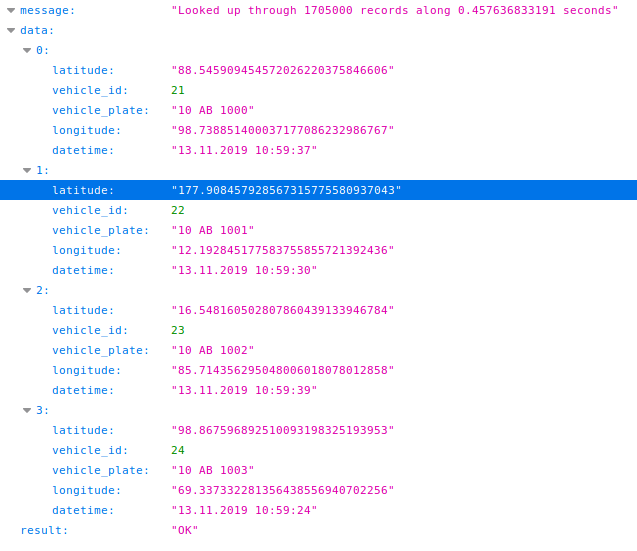

# Question 1

## Model

```python
# -*- coding: utf-8 -*-
from __future__ import unicode_literals

from django.db import models

class Vehicle(models.Model):
    plate = models.CharField(max_length=120)

class NavigationRecord(models.Model):
    vehicle = models.ForeignKey(Vehicle, on_delete=models.CASCADE)
    datetime = models.DateTimeField()
    latitude = models.DecimalField(max_digits=30, decimal_places=27)
    longitude = models.DecimalField(max_digits=30, decimal_places=27)
```

## View

```python
# -*- coding: utf-8 -*-
from __future__ import unicode_literals

from django.shortcuts import render
from django.http import JsonResponse
from django.db.models import Max, F
from django.db.models.functions import Now
from .models import *
import datetime

def get_last_points(request):

    # Following query set gets max datetime of each vehicle
    # This query set is equivalent with: 
    #   SELECT vehicle_id, MAX(datetime) 
    #     FROM navigation_record 
    #    WHERE datetime > CURRENT_TIMESTAMP - INTERVAL 2 days 
    # GROUP BY vehicle_id

    qs1 = NavigationRecord.objects.filter(datetime__gt=Now() - datetime.timedelta(hours=48)).values('vehicle').annotate(v=F('vehicle_id'), m=Max('datetime', distinct=True)).values('m')

    # and we are subquering above query set to get all information
    qs2 = NavigationRecord.objects.distinct('vehicle').filter(datetime__in=qs1).annotate(vehicle_id=F('vehicle__id'), plate=F('vehicle__plate')).values('plate', 'vehicle_id', 'latitude', 'longitude', 'datetime')
    
    # with list comprehension method we create list of points to be able to serialize them and send as a json response
    points = [{'vehicle_id': row.get('vehicle_id'), 'vehicle_plate': row.get('plate'), 'datetime': datetime.datetime.strftime(row.get('datetime'), "%d.%m.%Y %H:%M:%S"), 'latitude': row.get('latitude'), 'longitude': row.get('longitude')} for row in qs2]

    return JsonResponse({
        'result': 'OK',
        'data': points
    })
```

## Prerequisites

To run this application you have do following steps

1. Create virtual environment with python 2.7 interpreter
```
virtualenv -p $(which python2) .py2
```

2. Activate virtualenv
```
source .py2/bin/activate
```

3. Install requirements using requirements.txt file
```
pip install -r requirements.txt
```

4. Change credentials of database in settings.py

5. Migrate your tables to new database
```
python manage.py migrate
```

6. Feed your database with random datas (4 vehicles and ~10000000 navigation records)
```
python feed.py
```

7. Run development server
```
python manage.py runserver
```

8. Open your browser and type following url: [http://localhost:8000/](http://localhost:8000/)


Result:



---

## Video Tutorial
[](https://www.youtube.com/watch?v=1RudUjf6JZs)
