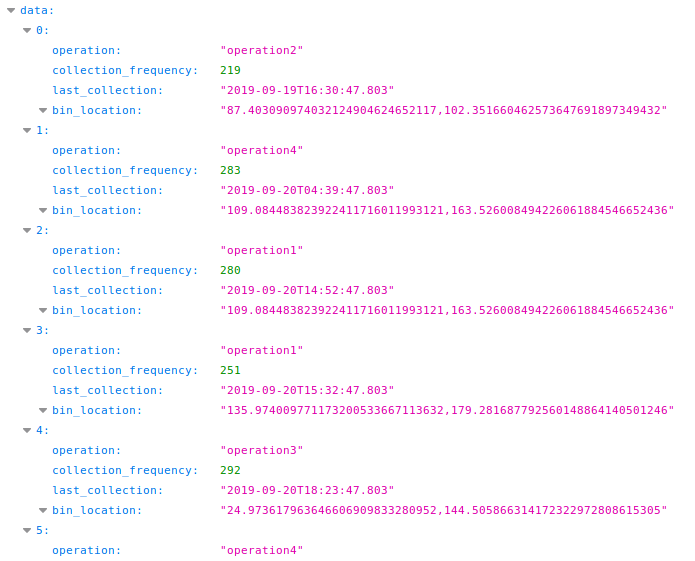
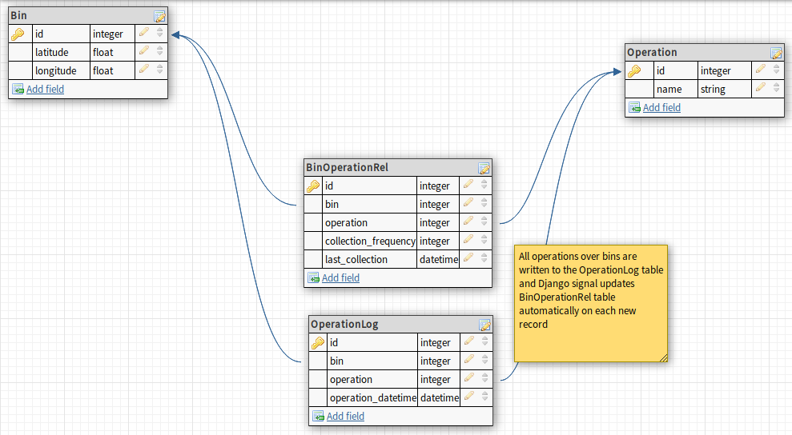

# Question #3

Public Demo App: [https://evreka-question3.herokuapp.com/](https://evreka-question3.herokuapp.com/)

## Prerequisites

1. Create virtualenv
```
virtualenv -p $(which python2) .py2
```

2. Activate virtualenv
```
source .py2/bin/activate
```

3. Install requirements using requirements.txt file
```
pip install -r requirements.txt
```

4. Change database credentials in settings.py

5. Migrate your models to the database
```
python manage.py migrate
```

6. Run feed.py to fill tables with dummy datas
```
python feed.py
```

7. Run development server
```
python manage.py runserver
```

8. Open your browser and type this url: http://localhost:8000/



## Entity Relationship Diagram


## Demo video
[](https://www.youtube.com/watch?v=t3zvBCEAc2k)

